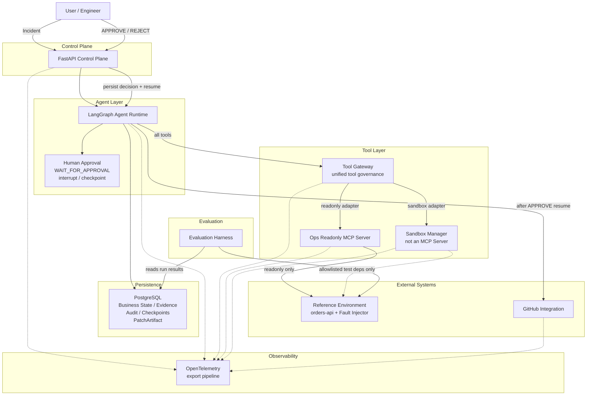

# IncidentPilot V1 Architecture

本文档是 V1 架构设计说明，依据已冻结的 `docs/PRODUCT_SPEC.md`。

本轮只定义架构边界与组件职责，不包含 application code、Dockerfile、依赖清单或 SQL schema。

## 1. Architecture Goal

IncidentPilot V1 的架构必须服务于以下真实业务链路：

```text
Incident
→ Agent investigation
→ Tool Calls
→ Evidence
→ Hypothesis
→ Verification
→ Root Cause
→ Sandbox
→ Patch
→ Tests
→ Human Approval
→ GitHub Pull Request
```

同时必须支持合法终止状态：

- `INSUFFICIENT_EVIDENCE`
- `NEEDS_HUMAN_INTERVENTION`
- `FAILED`

### 系统设计原则

- Single Agent
- explicit workflow
- durable execution
- structured tools
- evidence-first reasoning
- least privilege
- sandboxed mutation
- human-governed high-risk action
- traceable execution
- benchmarkable behavior

V1 **不设计 Multi-Agent**。

## 2. V1 Architecture Overview

### A. API / Control Plane

**Technology:** FastAPI

职责：

- 接收 Incident
- 启动 Agent Run
- 查询 Incident / Run 状态
- 查询 Evidence
- 查询 Tool Calls / PatchArtifact
- 接收 Human Approval / Reject
- 持久化审批决定并 resume workflow
- 返回最终调查结果

FastAPI **不负责** Agent 推理逻辑，也**不直接调用** GitHub Integration。

### B. Agent Runtime

**Technology:** LangGraph

职责：管理显式状态机。

```text
INCIDENT_RECEIVED
→ PLAN
→ COLLECT_EVIDENCE
→ FORM_HYPOTHESIS
→ VERIFY_HYPOTHESIS
```

如果 Evidence 不足：

```text
→ INSUFFICIENT_EVIDENCE
```

如果 Root Cause 确认：

```text
→ CREATE_SANDBOX
→ GENERATE_PATCH
→ RUN_TESTS
```

测试失败：

```text
→ REFLECT
→ GENERATE_PATCH
→ RUN_TESTS
```

测试通过后不能直接保留 ephemeral Sandbox 等待人工审批。必须先导出不可变补丁产物，再销毁 Sandbox：

```text
→ TESTS_PASS
→ EXPORT_PATCH_ARTIFACT
→ DESTROY_SANDBOX
→ WAIT_FOR_APPROVAL
```

Human Approval 通过后，workflow resume：

```text
→ CREATE_PULL_REQUEST
→ GitHub Integration
→ checkout / branch from exact base_commit_sha
→ apply exact approved PatchArtifact
→ create Pull Request
→ RESOLVED
```

Reject：

```text
→ NEEDS_HUMAN_INTERVENTION
```

#### PatchArtifact

Sandbox 是 ephemeral，不能为等待审批长期保留 container。因此测试通过的 Patch 必须导出为 **PatchArtifact**，并视为 **immutable artifact**。

概念上至少记录：

- `patch_artifact_id`
- `run_id`
- `base_commit_sha`
- `patch_diff`
- `patch_hash`
- `test_run_id`
- `created_at`

当前不设计 SQL schema。

**为什么必须保存 `base_commit_sha`：**

防止 Investigation 与 Approval 之间 repository HEAD 发生变化，保证测试过的 Patch 与最终提交的 Patch 有明确版本来源。

#### 为什么使用 LangGraph

- explicit state graph
- checkpoint
- resume after interruption
- Human-in-the-loop interrupt
- bounded loops
- deterministic routing around Agent decisions

LangGraph 在本项目中是 **durable workflow runtime**，不是聊天框架。

### C. Persistence Layer

**Technology:** PostgreSQL

PostgreSQL 是 V1 唯一主要持久化数据库。

概念上保存：

- Incident
- AgentRun
- Evidence
- Hypothesis
- ToolCall
- PatchArtifact
- TestRun
- Approval
- AuditEvent
- durable workflow checkpoint

业务数据和 LangGraph checkpoint 在逻辑上应分离，例如不同 schema / table namespace。

暂时不设计最终 SQL schema。

**PostgreSQL 不保存完整 OpenTelemetry Trace。**

PostgreSQL 是业务状态、审计与 checkpoint 存储；Trace 通过独立的 telemetry / export pipeline 输出。V1 当前不需要决定最终 observability backend。

**隔离要求：**

Reference Environment 的业务数据库与 IncidentPilot 自己的状态数据库必须逻辑隔离。

### D. Tool Gateway

Agent 不直接访问任意系统。所有能力通过 Tool Gateway 暴露。

Tool Gateway 是 IncidentPilot 内部的统一 Tool governance layer。Agent 只能使用 Tool Registry 中明确注册的工具。

Tool 分成两类，统一经 Tool Gateway 路由到 backend adapter：

**Readonly external tools：**

```text
LangGraph
→ Tool Gateway
→ MCP Client / Adapter
→ Ops Readonly MCP Server
→ Reference Environment
```

**Sandboxed mutation tools：**

```text
LangGraph
→ Tool Gateway
→ Sandbox Adapter
→ Sandbox Manager
→ isolated Docker sandbox
```

Tool Gateway 负责：

- schema validation
- permission policy
- timeout
- retry policy
- audit
- trace propagation
- result normalization
- execution budget accounting

Tool Gateway **不允许**暴露 unrestricted shell。

### D1. MCP 与 Sandbox 的边界

| 边界 | 用途 |
| --- | --- |
| Ops Readonly MCP Server | 仅用于 readonly external-system tools |
| Sandbox Manager | 仅用于 sandboxed mutation / test execution |

**Sandbox Manager 不是 MCP Server。**

MCP 只用于 readonly external-system boundary，不包装 `modify_code` / `apply_patch` / `run_tests` 等 mutation 操作。

### E. MCP Boundary

V1 使用 MCP，但必须选择性使用。不要把所有函数都包装成 MCP。

MCP 主要用于“外部只读系统能力”。

V1 设计一个 **Ops Readonly MCP Server**，逻辑上暴露：

- `read_metrics`
- `read_logs`
- `inspect_git_history`
- `inspect_git_diff`
- `read_source_code`
- `query_database_readonly`

这些工具只能读取 Reference Environment。

MCP Server 自身不拥有：

- production write permission
- host shell permission
- deployment permission
- arbitrary command execution

#### 为什么这样设计

MCP 用于标准化 Agent 与外部系统的接口，而不是取代 IncidentPilot 内部所有 Python 模块。

不要为每一个 Tool 创建独立 MCP Server。V1 一个 readonly MCP boundary 即可。

### F. Sandbox Manager

**Technology:** Docker

Sandbox Manager **不通过**通用 shell Tool 暴露给 Agent，也**不作为** MCP Server。

Agent 不能直接调用 Sandbox Manager；必须经 Tool Gateway → Sandbox Adapter 路由。

职责：

- 创建 ephemeral workspace
- 获取目标 repository 的隔离副本
- 创建 sandbox container
- 应用 Patch
- 执行 allowlisted test commands
- 收集 stdout / stderr / exit code
- 生成 diff
- 导出 PatchArtifact
- 销毁 sandbox

#### 主要测试模型

Sandbox 默认**不能**任意访问 Reference Environment。

```text
repository snapshot
→ isolated sandbox
→ local / packaged test fixtures
→ automated tests
```

如果某些 integration tests 后续确实需要网络：

- 只能访问明确 allowlisted 的 Reference Environment test dependency
- 禁止 host networking
- 禁止 unrestricted outbound network
- 禁止 production endpoint access

#### 安全目标

- no production credentials
- no developer workspace modification
- no host filesystem access except isolated workspace
- network disabled by default
- CPU limit
- memory limit
- PID limit
- execution timeout
- command audit
- ephemeral lifecycle

Agent 不能得到一个 unrestricted shell。

Agent 只能通过受控操作：

- `create_sandbox`
- `apply_patch`
- `run_tests`
- `inspect_test_results`
- `inspect_patch_diff`

注意：这里是 architecture definition，不在本轮实现 Docker。

### G. Human Approval

Human Approval 是正式 workflow state，不是 Prompt 中一句“请用户确认”。

正确流程：

```text
LangGraph
→ WAIT_FOR_APPROVAL
→ interrupt / checkpoint

User
→ FastAPI approval endpoint
→ persist APPROVE / REJECT
→ resume LangGraph workflow
```

`APPROVE`：

```text
resume
→ CREATE_PULL_REQUEST
→ GitHub Integration
```

`REJECT`：

```text
resume
→ NEEDS_HUMAN_INTERVENTION
```

审批内容至少应包括：

- Root Cause
- referenced Evidence
- PatchArtifact（diff / hash / base_commit_sha）
- Test results
- risk summary

`REJECT` 不允许创建 PR。

**关键边界：** GitHub Integration 必须由**恢复后的 workflow** 调用，而不是 Approval component 直接调用。

### H. GitHub Integration

GitHub Integration 只负责：

- create branch from exact `base_commit_sha`
- apply exact approved PatchArtifact
- push approved patch
- create Pull Request

必须发生在 Human Approval 之后，且必须由 resume 后的 workflow 触发。

GitHub token **不应该**进入 Sandbox。Agent **不应该**直接获得 GitHub credential。Credential 由受控 integration layer 持有。

### I. Reference Environment

Reference Environment 是独立于 Agent Runtime 的受控故障实验系统。

至少概念包含：

- reference backend service
- reference database
- structured logs
- metrics
- source repository
- automated tests
- fault injector

V1 可以以 `orders-api` 作为主要 reference service。

Fault Injector 负责可重复制造：

- slow query
- missing index
- bad commit
- null exception
- dependency timeout
- connection pool issue
- schema mismatch
- cache failure
- bad configuration

每个 Fault Case 必须能够：

```text
setup
→ reproduce
→ investigate
→ reset
```

Benchmark 不允许依赖人工手动制造故障。

### J. Observability

**Technology:** OpenTelemetry

OpenTelemetry 是 **cross-cutting observability concern**，不仅仅观测 LangGraph。

API / Agent / Tool Gateway / MCP / Sandbox / GitHub Integration 均产生或传播 trace context。

每一个 Agent Run 应拥有 `trace_id`。

Trace 应能够关联：

```text
Incident
→ LangGraph node
→ LLM call
→ Tool Call
→ MCP request
→ Sandbox action
→ Test Run
→ Approval
→ GitHub action
```

需要记录：

- latency
- status
- tool name
- failure
- retry
- token usage（如果模型供应商提供）
- cost metadata（如果可计算）

#### Evidence 与 Trace 的边界

| 概念 | 含义 |
| --- | --- |
| Evidence | Agent 用来判断 Root Cause 的业务证据 |
| Trace | 系统自身运行的工程观测数据 |

二者不可混淆。

### K. Evaluation Harness

Evaluation 是独立模块，不嵌进 Agent Prompt。

职责：运行 Fault Cases 并计算：

- Root Cause Accuracy
- Tool Selection Accuracy
- Incident Resolution Rate
- Patch Test Pass Rate
- Unsafe Action Rate
- Average Tool Calls
- Median Resolution Time
- Token / Model Cost

Ground Truth 由 Fault Case 定义。**不要**使用 Agent 自己生成的答案作为 Ground Truth。

## 3. Components We Explicitly Do NOT Use in V1

V1 明确不引入：

| 组件 | 不使用原因 |
| --- | --- |
| Redis | V1 尚无足够强的缓存/队列需求，引入会增加运行复杂度 |
| Celery | V1 无需独立 worker 集群；LangGraph 已承担 durable execution |
| Kafka | V1 无高吞吐事件流需求 |
| Vector Database | V1 不做语义检索式调查 |
| RAG | V1 依赖真实 Tool Call 证据，而不是知识库召回 |
| Multi-Agent | V1 先把单 Agent 闭环做深 |
| A2A | V1 无跨 Agent 协作场景 |
| Kubernetes | V1 的隔离需求由 Docker Sandbox 满足即可 |
| Fine-tuning | V1 先验证 workflow、工具边界与评测体系 |

### 关于 Redis / Celery

Redis / Celery 不是永远不用。只是当前 V1 没有足够强的需求证明它们值得增加运行复杂度。

如果未来出现：

- distributed workers
- queue durability requirements
- high concurrency
- independent background execution

再通过 ADR 引入。

## 4. Data Flow

完整数据流：

1. FastAPI 接收 Incident
2. 创建 AgentRun
3. LangGraph 开始 workflow
4. Agent 通过 Tool Gateway 调用 readonly MCP tools
5. MCP 返回结构化结果
6. 有价值结果保存为 Evidence
7. Agent 创建 Hypothesis，并引用 Evidence ID
8. Verification 再调用工具验证
9. Root Cause 确认
10. Sandbox Manager 创建隔离环境
11. Agent 生成 Patch
12. Sandbox 应用 Patch
13. Test Runner 执行真实测试
14. 失败则进入有限次数 Reflection
15. 测试通过后导出 PatchArtifact，销毁 Sandbox
16. 进入 `WAIT_FOR_APPROVAL`
17. LangGraph interrupt / checkpoint 持久化状态
18. FastAPI 接收人工审批并持久化 APPROVE / REJECT
19. workflow resume
20. resume 后的 workflow 调用 GitHub Integration：从 `base_commit_sha` 建分支，应用已批准的 PatchArtifact，创建 PR
21. Run 进入 `RESOLVED`

## 5. Architecture Diagram



目标：一个技术面试官 30 秒能够看懂。

## 6. Key Architecture Decisions

### ADR-001

**Decision:** Use explicit single-agent state graph instead of Multi-Agent.  
**Reason:** V1 先把一条可验证闭环做深，减少协作与一致性成本。  
**Trade-off:** 复杂任务分解能力弱于多 Agent，但可测性与可恢复性更强。

### ADR-002

**Decision:** Use LangGraph for durable workflow and Human-in-the-loop.  
**Reason:** 需要 checkpoint、interrupt/resume 与显式状态路由。  
**Trade-off:** 引入特定框架绑定；换来的是比手写循环更清晰的 durable execution。

### ADR-003

**Decision:** Use PostgreSQL as primary durable storage.  
**Reason:** 业务状态、审计与 checkpoint 需要事务与关系查询能力。  
**Trade-off:** 需维护 schema 与迁移；避免多套存储导致一致性分裂。

### ADR-004

**Decision:** Do not introduce Redis in V1.  
**Reason:** 当前没有足够缓存/队列需求证明额外运行复杂度。  
**Trade-off:** 暂无专用缓存层；未来若出现高并发/分布式需求再引入。

### ADR-005

**Decision:** Use MCP selectively for readonly external-system tools.  
**Reason:** 标准化外部只读接口，同时限制 Agent 能力面。  
**Trade-off:** 不是所有内部函数都走 MCP，但边界更清晰、更安全。

### ADR-006

**Decision:** Keep mutation operations behind Sandbox Manager.  
**Reason:** 代码修改必须隔离、可审计、可销毁。  
**Trade-off:** 比直接改工作区更重，换来安全与可复现。

### ADR-007

**Decision:** Require Human Approval before GitHub Pull Request creation.  
**Reason:** PR 是高风险、对外可见动作，必须 Human-in-the-loop。  
**Trade-off:** 无法全自动闭环；换来治理与责任边界。

### ADR-008

**Decision:** Use OpenTelemetry for vendor-neutral execution tracing.  
**Reason:** Incident 级 Trace 需要跨 LangGraph / Tool / MCP / Sandbox 关联。  
**Trade-off:** 需要约定 span 结构；避免绑定单一可观测厂商。

### ADR-009

**Decision:** Separate Reference Environment from IncidentPilot control plane.  
**Reason:** 产品不连接真实企业 production；实验环境必须可控可复现。  
**Trade-off:** 需要维护模拟环境与 Fault Injector；换来可评测与可诚实汇报结果。

### ADR-010

**Decision:** Evaluation Ground Truth comes from Fault Cases, not the Agent.  
**Reason:** 防止自评自证；Benchmark 必须可重复。  
**Trade-off:** 需要预先定义 Fault Cases；换来可信指标。

### ADR-011

**Decision:** Persist tested patches as immutable PatchArtifact before Human Approval.  
**Reason:** Sandbox 是 ephemeral；审批期间不能保留 container，且必须锁定 `base_commit_sha` 保证测试过的补丁与最终提交一致。  
**Trade-off:** 增加一次导出/校验步骤；换来审批可等待、补丁版本可追溯。

## 7. Preliminary Repository Layout

以下仅为概念目录结构，本轮不创建任何目录。

```text
incidentpilot/
├── src/
│   └── incidentpilot/
│       ├── api/
│       ├── agent/
│       ├── tools/
│       ├── persistence/
│       ├── sandbox/
│       ├── github/
│       ├── observability/
│       └── models/
│
├── mcp/
│   └── ops_readonly/
│
├── reference/
│   └── orders_api/
│
├── benchmarks/
├── tests/
└── docs/
```

禁止为了“企业级”创建大量空目录。

## 8. Architecture Constraints

- modular monolith first
- no microservice architecture in V1
- one Agent Runtime
- one primary PostgreSQL
- one readonly MCP boundary
- one Sandbox Manager
- all Agent tools routed through Tool Gateway
- Sandbox Manager is not an MCP Server
- no unrestricted shell
- no production credentials in Agent or Sandbox
- all high-risk actions audited
- all workflows bounded
- every Root Cause must reference Evidence
- tested patches are exported as immutable PatchArtifact before approval
- Sandbox has no default network access to Reference Environment
- GitHub Integration is invoked only by resumed workflow after APPROVE

---

*本架构文档服务于 V1 Product Ground Truth，不虚构性能数据，不提前绑定超出必要范围的技术组件。*
